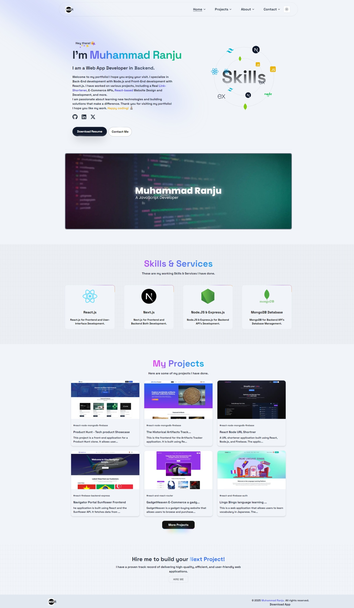

# Md Ranju Portfolio Next.js

## Overview

This is a provisional README file for the `mdranju-portfolio-nextjs` project. The project is currently under development, and functionalities are not yet complete.

## Project Structure

```
/e:/mdranju-portfolio-nextjs/
├── src/
├─── api/
├─── app/
├─── components/
├─── config/
├─── data/
├─── lib/
├─── ui/   
├─── utils/   
├── README.md
├── package.json
├── next.config.js
├── tailwind.config.js
└── tsconfig.json
```

## Getting Started

## Packages

- [Next.js](https://nextjs.org/)
- [Tailwind CSS](https://tailwindcss.com/)
- [React](https://reactjs.org/)
- [TypeScript](https://www.typescriptlang.org/)
- [Node.js](https://nodejs.org/)
- [Express.js](https://expressjs.com/)
- [MongoDB](https://www.mongodb.com/)
- [React.js](https://reactjs.org/)

### Prerequisites

- Node.js
- npm or yarn

### Installation

1. Clone the repository:
   ```bash
   git clone https://github.com/muhammadranju/mdranju-portfolio-nextjs
   ```
2. Navigate to the project directory:
   ```bash
   cd mdranju-portfolio-nextjs
   ```
3. Install dependencies:
   ```bash
   npm install
   ```
   or
   ```bash
   yarn install
   ```

### Running the Project

To start the development server, run:

```bash
npm run dev
```

or

```bash
yarn dev
```

Open [http://localhost:3000](http://localhost:3000) to view it in the browser.

## Contributing

Contributions are welcome! Please open an issue or submit a pull request.

## License

This project is licensed under the MIT License.

## Contact

For any inquiries, please contact mdranju23@gmail.com.



